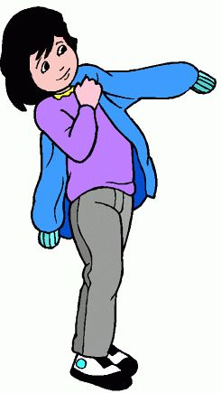

### family Album U.S.A
* __occasionally__ oc·ca·sion·al·ly[ əˈ**k**eɪʒnəli ]  : sometime; not often; *부사* ; 1. 가끔     
We _occasionally_ meet for a drink after work. 우리는 가끔 퇴근 후에 한잔 하러 만난다.    
I date _occasionally_, but my work keeps me busy.

* __keep__ [ kiːp ]: *동사형* 1.	(특정한 상태위치를) 유지하다, (특정한 상태위치에)계속 있다 2.	~을 계속하다 3.	먹고 사는 데 필요한 것들; 생활비,  3인칭 단수 현재 *keeps* 과거 *kept* 과거분사 *kept* 현재분사 *keeping*    

speaking of keeping busy ~...  __speaking of__ : Use this expression to change the subject in a conversation   
* __Speaking of which__ : 그런데 얘기가 나와서 말인데

__"귀가"의 영어 표현__   
go home, come home, get home은 "귀가"의 의미이지만,   
다음과 같은 차이가 있습니다(참고 home은 명사가 아니라 부사입니다).

**go home**의 의미와 예문: go home은 (앞으로) 이동 될이 집이라는 뜻입니다.
```
Let 's go home now. (외출 처에서) 이제 집에 돌아 갑시다
```

**come home**의 의미와 예문 : come home은 "화자"집에있는 상태로 집에 대해 이야기 할 때 사용합니다.
```
What time did you come home yesterday? (집에서 부모가 아이에게) 당신은 어제 몇시에 돌아 왔습니까?
```

**get home**의 의미와 예문 : get home 집에 "도착하는 것 '에 초점이있는 단어입니다. 그러므로 시간에 대한 단어와 함께 사용되는 경우가 많습니다.
```
I got home around six. 6시에 귀가했습니다.
```

***put on*** : 입다.
</img>
